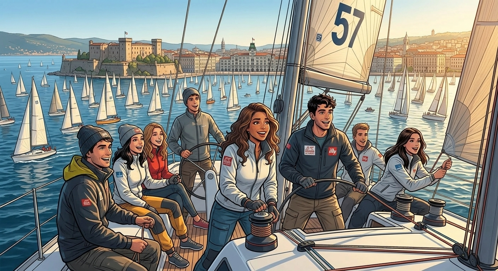

The Barcolana, officially the world’s largest sailing regatta, celebrates its 57th edition this 2025. And after another success, Trieste proves that no other place could be a better home for the regatta. 

From October 3 to 12, more than 2,300 athletes joined sailing, SUP (Stand-up Paddleboarding), and running competitions. The Barcolana filled the city with more than 600 events, on sea and land. With the main focus on Sunday, more than 17.000 sailors from Italy, Slovenia, Austria, Croatia, Germany and Switzerland covered the Gulf in a breathtaking two-hour race.

### A Feeling

But the Barcolana is more than a race. It is a feeling. With hope, one feeling that does not disappear in the long run. 

For locals, it marks the end of summer and the start of that windy season when the Bora sweeps through the city. For visitors, it’s a rare chance to experience Trieste at its more vivid moment. 

And for sailors, it does not really matter where they come from. For that short instant they belong to Trieste and their memories belong to the sea. 

For two weeks,Trieste becomes a city that doesn’t sleep. Instead, it dances all night long. Streets turn into stages, the seafront and the city center become a carnival of music, food, and spectacles. Old friends meet. New friendships start. The only thing for sure is that everyone feels deeply every day during the Barcolana. 

### Mare e Terra events

Days are filled with workshops on sustainability, kids learning to sail, art exhibitions, and sports events open to all. Evenings bring live concerts, crowded bars, and spontaneous dancing under the streetlights. The energy flows as freely as the wind — from the waterfront to the narrow alleys of Cavana, where locals welcome newcomers with an easy smile and a glass of wine. 

This year, the Barcolana expanded beyond the horizons with the “Borgo Cavana” project, transforming the historic quarter once known for fishermen and salt traders into part of the official festival map. Cavana joined Villaggio Barcolana. The neighborhood opened the door to a mix of concerts, artisan markets, and street performances. 

Transforming the neighborhood for the Barcolana. The project aims to expand Barcolana horizons beyond the river, including the heart of the city center. Cavana is again a “borgo” and becomes part of the Villagio Barcolana. 

Generali and Barcolana renewed the initiative, opening the fifth year edition of the “Generali Women In Sailing Trophy”. The 2025 winner, Giulia Ascioni, led to the first female skipper, (person responsible for the boat). As well, this is the first mixed crew arriving to the victory.The team will receive a coaching and leadership program delivered by Generali Academy. A step closer to having more women in sailing and more women in leadership roles. 

### Sailing for women

A Taste of Trieste 

Of course, no Triestine event would be complete without great coffee. Local icon Illy Caffè hosted an exclusive workshop with tasting in Piazza Ponterosso, letting visitors discover the aromas and stories behind the Italian most recognized coffee brand. The only condition to participate is the reservation online, for the limited spots. 

### Where to watch the race?

● San Giusto Castle: The best panoramic view, though it gets crowded fast. Bring your wallet and patience. Wake up earlier than usual and skip the line. 

● Piazza Unità d’Italia: The heart of the celebration, packed but nice. Not for everyone. Not the most comfortable choice, but the cheapest one. The center of the atmosphere and the food stands. Useful for the beginning of the race and the end. 

● Barcola Promenade: Peaceful and beautiful by itself. Quite near to Miramare. Harder to reach but worth it for those who prefer a slower pace(and have a car). 

### What to expect?

The Barcolana isn’t just an event. It’s a tradition, a cozy welcome, and a reminder of why Trieste feels so special and weird. 

If you ever find yourself in Trieste in the second week of October, try to immerse in the vibe. It is impossible to follow everything, and exhaustive. Sacrifice some activities for those that are more interesting for you. Take a break and do something different, instead of staying from sunrise to late night. Check in advance the program and plan your own itinerary. Stressfree, fun guaranteed. An experience to try at least once. Visit Barcolana.it.
